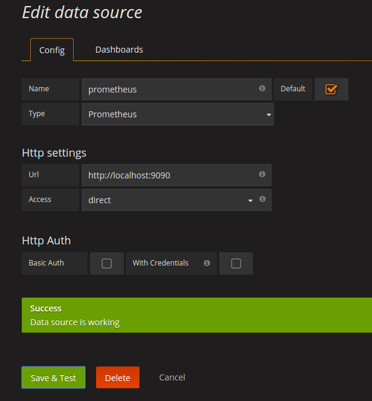

# Suite Prometheus Grafana

Extrait d'un [blog mai2016](https://finestructure.co/blog/2016/5/16/monitoring-with-prometheus-grafana-docker-part-1):

* **Prometheus** - this is the central piece, it contains the time series database and the logic of scraping stats from exporters (see below) as well as alerts.
* **Grafana** is the ‘face’ of Prometheus. While Prometheus exposes some of its internals like settings and the stats it gathers via basic web front-ends, it delegates the heavy lifting of proper graphical displays and dashboards to Grafana.
* **Alertmanager** manages the routing of alerts which Prometheus raises to various different channels like email, pagers, slack - and so on. So while Prometheus collects stats and raises alerts it is completely agnostic of where these alerts should be displayed. This is where the alertmanager picks up.
* **Exporters** are http endpoints which expose ‘prometheus metrics’ for scraping by the Prometheus server. What this means is that this is a pull set-up. Note that it is also possible to set up a push-gateway which is essentially an intermediary push target which Prometheus can then scrape. This is useful for scenarios where pull is not appropriate or feasible (for example short lived processes).

Plan de la démo:

* Setup **initial** : un `docker-compose.yml` avec tous les services
  * Visualisation sur Prometheus et Grafana
* Setup **Prometheus**
  * voir répertoire prometheus
* Setup **Alertmanager**
  * voir répertoire alertmanager
* Setup **Grafana**
  * voir répertoire alertmanager
  * import / export de template *dashboard* et *graph*
* **Custom Export** et **Custom Metrics**
  * Code
  * Intégration

Utilisation des images dockers **latest**. Pour l'instant : prometheus 1.7.1 (la version 2.0 ne sera pas compatible avec les données acquises sous un ancienne version)

Voir : <https://fabxc.org/blog/2017-04-10-writing-a-tsdb/>

## Modèle économique

> **Prometheus** is 100% open source and community-driven. All components are available under the Apache 2 License on GitHub. <https://prometheus.io/>

## Organisation

**docker-compose.yml** :

* tous les services y compris 2 *exporters*

### -- Prometheus

Les fichiers sont dans `prometheus`

**prometheus.yml** :

* configuration générale
* liste des règles (pour les alertes): `*.rules`
* configuration pour chaque moniteur

### -- Grafana

Les fichiers sont dans `grafana`

Les fichiers *.json sont des descriptions de **dashboards**

### -- Alertmanager

Les fichiers sont dans `alertmanager`

`alertmanager.yml` décrit les cibles des alertes

## Déploiement

Lancer, arréter:

``` sh
docker-compose up -d
docker-compose down --remove-orphans
```

### -- Prometheus

Vérifications des services lancés : sur http://localhost:9090

* Status
* Alert

Premiers graphes :

Exemples avec **http_requests_total** 

* **sélection par description** http_requests_total{handler=~"prometheus|alerts"}
* **sélection temporelle** http_requests_total{job="prometheus"}[5m] 
  * > vue console uniquement !
* **aggrégation** sum(http_requests_total{job="prometheus"})

Requêtes complexes :
sum(rate(http_requests_total[5m])) by (job)

Description du langage **PromQL** : <https://prometheus.io/docs/querying/basics/>

Création d'une alerte sur : rate(http_requests_total{job="prometheus"})

### -- Grafana

Etapes :

1. Data Source



2. Dashboard

Import Dashboard : `monitor_services.json`

> Exemple de création d'un dashboard : TODO
> Exemple de création d'une alerte : TODO

## Création d'une métrique

Deux possibilités :

* création d'un **Export** : code qui va observer
* intégration de l'instrumentation dans un code existant

Types de métriques :

Description des éléments à définir :
--> fonctions

Enregistrement du service

Métriques visibles : http://localhost:9090/metrics


