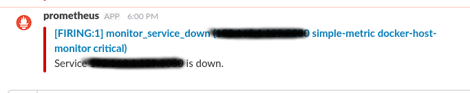

# Suite Prometheus Grafana

Extrait d'un [blog mai2016](https://finestructure.co/blog/2016/5/16/monitoring-with-prometheus-grafana-docker-part-1):

* **Prometheus** - this is the central piece, it contains the time series database and the logic of scraping stats from exporters (see below) as well as alerts.
* **Grafana** is the ‘face’ of Prometheus. While Prometheus exposes some of its internals like settings and the stats it gathers via basic web front-ends, it delegates the heavy lifting of proper graphical displays and dashboards to Grafana.
* **Alertmanager** manages the routing of alerts which Prometheus raises to various different channels like email, pagers, slack - and so on. So while Prometheus collects stats and raises alerts it is completely agnostic of where these alerts should be displayed. This is where the alertmanager picks up.
* **Exporters** are http endpoints which expose ‘prometheus metrics’ for scraping by the Prometheus server. What this means is that this is a pull set-up. Note that it is also possible to set up a push-gateway which is essentially an intermediary push target which Prometheus can then scrape. This is useful for scenarios where pull is not appropriate or feasible (for example short lived processes).

Plan de la démo:

* Setup **initial** : un `docker-compose.yml` avec tous les services
  * Visualisation sur Prometheus et Grafana
* Setup **Prometheus**
  * voir répertoire prometheus
* Setup **Alertmanager**
  * voir répertoire alertmanager
* Setup **Grafana**
  * voir répertoire alertmanager
  * import / export de template *dashboard* et *graph*
* Custom Export et Custom Metrics
  * Code
  * Intégration


## Modèle économique

> **Prometheus** is 100% open source and community-driven. All components are available under the Apache 2 License on GitHub. <https://prometheus.io/>


## Prometheus

### Configuration

* docker-compose :

``` yml
version: '3.1'

services:
  prometheus:
    image: prom/prometheus:latest
    container_name: prometheus
    volumes:
      - ./prometheus/:/etc/prometheus/
      - prometheus_data:/prometheus
    command:
        - '-config.file=/etc/prometheus/prometheus.yml'
        - '-storage.local.path=/prometheus'
        - '-alertmanager.url=http://alertmanager:9093'
        - '-storage.local.memory-chunks=100000'
    restart: unless-stopped
    expose:
      - 9090
    ports:
      - 9090:9090
    networks:
      - monitor-net
    labels:
      org.label-schema.group: "monitoring"

networks:
  monitor-net:
    driver: bridge

volumes:
    prometheus_data: {}
```

* **prometheus.yml** : donne la liste des *exporters* (tout ce qui publie des données instrumentées)

``` yml
global:
  scrape_interval:     15s # By default, scrape targets every 15 seconds.
  external_labels: # used for alerting
    monitor: 'docker-host-monitor'

rule_files: # alert rules
  - "targets.rules"
  - "host.rules"
  - "containers.rules"

scrape_configs:
  # ...
  # custom metric
  - job_name: 'simple-metric'
    scrape_interval: 15s
    static_configs:
      - targets: ['<ip>:8080']
```

Vérification :


### Conseils

> The Prometheus image uses a volume to store the actual metrics. For production deployments it is highly recommended to use the Data Volume Container pattern to ease managing the data on Prometheus upgrades. (<https://prometheus.io/docs/introduction/install/>)

## Grafana

### Fichiers configuration

### Dashboard

### Langage

Exemples :


### Autres sources de données

* ElasticSearch (TODO)

## Instrumentation (Exporters)

Pour que prometheus puisse récupérer les *endpoints*, il faut un serveur sur les machines qui en publient :

``` sh
[/dev] python3 -m http.server
Serving HTTP on 0.0.0.0 port 8000 ...
```
### cAdvisor

* [Github](https://github.com/google/cadvisor) il existe un client **go**

Il faut un cAdvisor par *Docker host*

Lancement en solo :
``` sh
docker run \
  --volume=/:/rootfs:ro \
  --volume=/var/run:/var/run:rw \
  --volume=/sys:/sys:ro \
  --volume=/var/lib/docker/:/var/lib/docker:ro \
  --publish=8080:8080 \
  --detach=true \
  --name=cadvisor \
  google/cadvisor:latest
```

Vérification sur `http://localhost:8080`

Pour virer l'erreur `-print`, faire une image local avec :

```
google-cadvisor:v0.25.0
MAINTAINER pro zpang

# time 
RUN apk add --update tzdata && rm -rf /var/cache/apk/*
RUN cp /usr/share/zoneinfo/Hongkong /etc/localtime # à adapter

# add gnu find 
RUN apk add --update findutils && rm -rf /var/cache/apk/*
```

## Alertes

### Prometheus

Permet de faire des alertes "sortant du monitoring" (mail, slack, etc...)

* [Docker](https://hub.docker.com/r/prom/alertmanager/)
* Fichier config qui décrit les cibles pour les alertes (extrait de *alertmanager.yml*)

``` yml
route:
    receiver: 'slack'

receivers:
    - name: 'slack'
      slack_configs:
          - send_resolved: true
            text: "{{ .CommonAnnotations.description }}"
            username: 'prometheus'
            channel: '#awsdeploy'  # temporaire
            api_url: <webhook>
```

* Création du webhook **Slack** : > Manage > Custom Integrations
 



Vérification :

* Configuration <http://localhost:9093/#/status>
* Liste des règles <http://localhost:9090/rules>

### Grafana

Permet de faire des *warnings*/*alerts* dans des *Dashboards* mais aussi des notifications :


## Références

* **Docker** : [Prometheus, alertmanager, et divers exporters](https://hub.docker.com/u/prom/), [Grafana](https://hub.docker.com/r/grafana/grafana/)
* **Github** :
* **Sites officiels** : [Prometheus](https://prometheus.io/)
* **Docs** : [Prometheus](https://prometheus.io/docs/introduction/overview/), [Grafana](http://docs.grafana.org/)
* **Communities** : [Prometheus](https://prometheus.io/community/)
* **Playground** : [Grafana](http://play.grafana.org/dashboard/db/grafana-play-home?orgId=1)


// notes

Run Prometheus, and it will ask your app for the latest stats every, say, 15 seconds. This happens via a GET request to /metrics, a URL which your app is expected to expose (this seemed overly complicated to me at first, but it actually makes things surprisingly hassle-free).

new handler to log metrics and expose an endpoint for Prometheus, and


https://www.robustperception.io/push-needs-service-discovery/
Get Instrumented: How Prometheus Can Unify Your Metrics
+ biblio

instrumentation vs logging
http://peter.bourgon.org/blog/2016/02/07/logging-v-instrumentation.html
http://peter.bourgon.org/blog/2017/02/21/metrics-tracing-and-logging.html +pic
intrum --> number

push vs pull
https://www.robustperception.io/push-needs-service-discovery/

beat -> push (à priori)

From : http://peter.bourgon.org/ok-log/
"
Instrumentation? Prometheus is the king of the hill. Logging? Hmm. Here I was stumped!

I admit that I'm opining quite heavily here. Feel free to take me to task on Twitter.

The defacto answer seems to be Elastic and the ELK stack. 
++ log on prometheus

 log data is orders of magnitude larger than instrumentation
"
 defining characteristic of **metrics** is that they are aggregatable: they are the atoms that compose into a single logical gauge, counter, or histogram over a span of time.
 
 defining characteristic of **logging** is that it deals with discrete events


https://www.paypal-engineering.com/2016/04/11/statistics-for-software/

plein de lien biblio: https://hynek.me/talks/prometheus/

- Measurement and the ways it helps IT and business
- Tools that help with measurement
- (MOOC https://www.class-central.com/mooc/4013/udacity-intro-to-devops)
- 
- 
- https://medium.com/@basilio.vera/docker-swarm-metrics-in-prometheus-e02a6a5745a
- -> docker swarm metrics