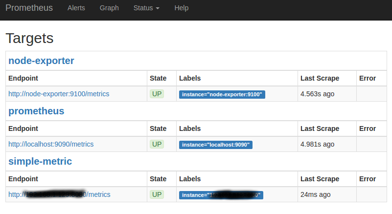
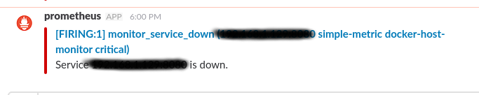

# Suite Prometheus Grafana

Extrait d'un [blog mai2016](https://finestructure.co/blog/2016/5/16/monitoring-with-prometheus-grafana-docker-part-1):

* **Prometheus** - this is the central piece, it contains the time series database and the logic of scraping stats from exporters (see below) as well as alerts.
* **Grafana** is the ‘face’ of Prometheus. While Prometheus exposes some of its internals like settings and the stats it gathers via basic web front-ends, it delegates the heavy lifting of proper graphical displays and dashboards to Grafana.
* **Alertmanager** manages the routing of alerts which Prometheus raises to various different channels like email, pagers, slack - and so on. So while Prometheus collects stats and raises alerts it is completely agnostic of where these alerts should be displayed. This is where the alertmanager picks up.
* **Exporters** are http endpoints which expose ‘prometheus metrics’ for scraping by the Prometheus server. What this means is that this is a pull set-up. Note that it is also possible to set up a push-gateway which is essentially an intermediary push target which Prometheus can then scrape. This is useful for scenarios where pull is not appropriate or feasible (for example short lived processes).

## Modèle économique

## Prometheus

### Configuration

* docker-compose :

``` yml
version: '3.1'

services:
  prometheus:
    image: prom/prometheus:latest
    container_name: prometheus
    volumes:
      - ./prometheus/:/etc/prometheus/
      - prometheus_data:/prometheus
    command:
        - '-config.file=/etc/prometheus/prometheus.yml'
        - '-storage.local.path=/prometheus'
        - '-alertmanager.url=http://alertmanager:9093'
        - '-storage.local.memory-chunks=100000'
    restart: unless-stopped
    expose:
      - 9090
    ports:
      - 9090:9090
    # depends_on:   # is it necessary ?
    #   - cadvisor # permet de monitorer les dockers (exporter officiel prometheus)
    networks:
      - monitor-net
    labels:
      org.label-schema.group: "monitoring"

networks:
  monitor-net:
    driver: bridge

volumes:
    prometheus_data: {}
```

* **prometheus.yml** : donne la liste des *exporters* (tout ce qui publie des données instrumentées)

``` yml
global:
  scrape_interval:     15s # By default, scrape targets every 15 seconds.
  external_labels: # used for alerting
    monitor: 'docker-host-monitor'

rule_files: # alert rules
  - "targets.rules"
  - "host.rules"
  - "containers.rules"

scrape_configs:
  # ...
  # custom metric
  - job_name: 'simple-metric'
    scrape_interval: 15s
    static_configs:
      - targets: ['192.168.1.129:8080']
```

Vérification :




## Grafana

### Fichiers configuration

### Dashboard

### Langage TODO

### Autres sources de données

* ElasticSearch (TODO)

## Instrumentation (Exporters)

Pour que prometheus puisse récupérer les *endpoints*, il faut un serveur sur les machines qui en publient :

``` sh
[/dev] python3 -m http.server
Serving HTTP on 0.0.0.0 port 8000 ...
```


## Alertes

### Prometheus

Permet de faire des alertes "sortant du monitoring" (mail, slack, etc...)

* [Docker](https://hub.docker.com/r/prom/alertmanager/)
* Fichier config qui décrit les cibles pour les alertes (extrait de *alertmanager.yml*)

``` yml
route:
    receiver: 'slack'

receivers:
    - name: 'slack'
      slack_configs:
          - send_resolved: true
            text: "{{ .CommonAnnotations.description }}"
            username: 'prometheus'
            channel: '#awsdeploy'  # temporaire
            api_url: <webhook>
```

* Création du webhook **Slack** : > Manage > Custom Integrations
 



Vérification :

* Configuration <http://localhost:9093/#/status>
* Liste des règles <http://localhost:9090/rules>

### Grafana

Permet de faire des *warnings*/*alerts* dans des *Dashboard*.


## Références

* **Docker** : [Prometheus, alertmanager, et divers exporters](https://hub.docker.com/u/prom/), [Grafana](https://hub.docker.com/r/grafana/grafana/)
* **Github** :
* **Sites officiels** : [Prometheus](https://prometheus.io/)
* **Docs** : [Grafana](http://docs.grafana.org/)
* **Communities** : [Prometheus](https://prometheus.io/community/)
* **Playground** : [Grafana](http://play.grafana.org/dashboard/db/grafana-play-home?orgId=1)
